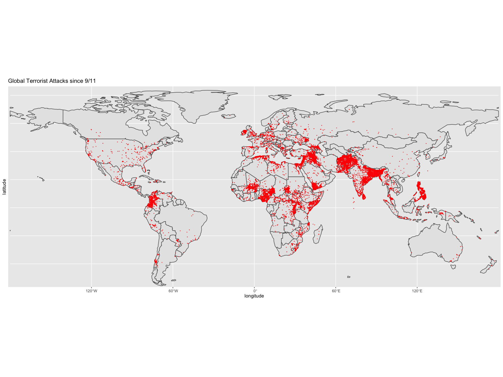
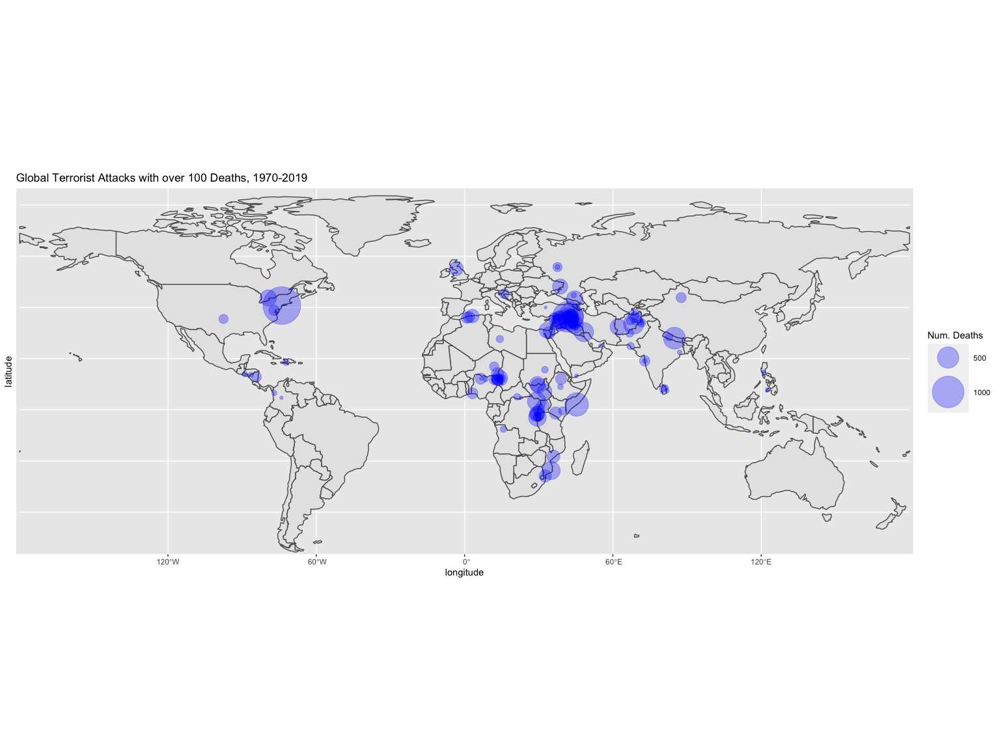
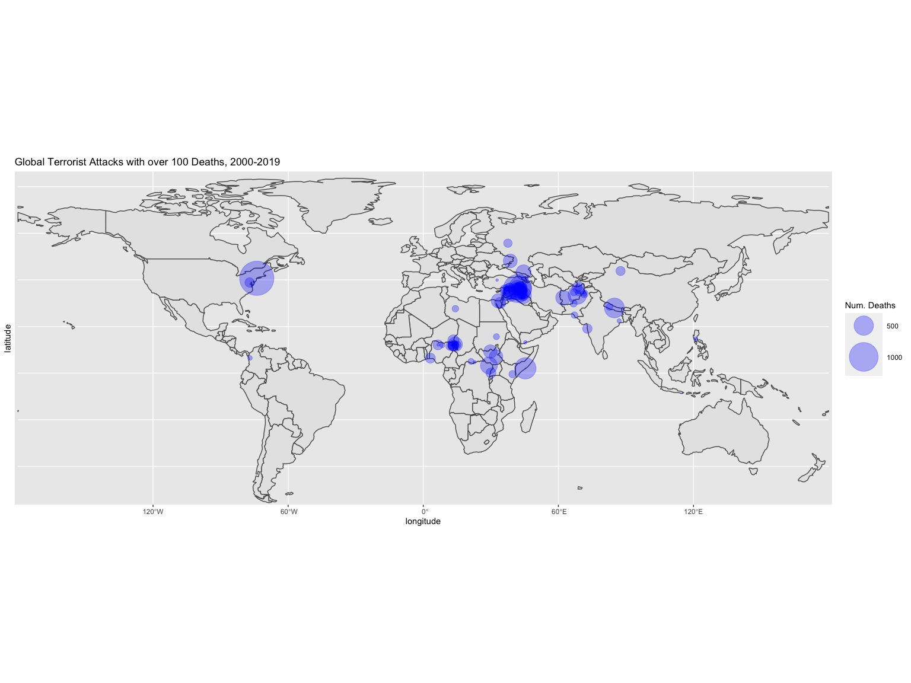
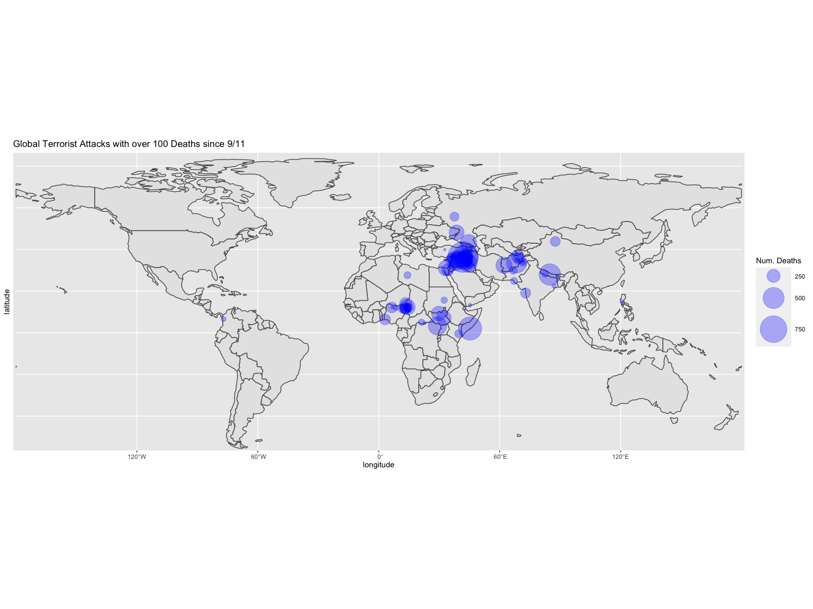
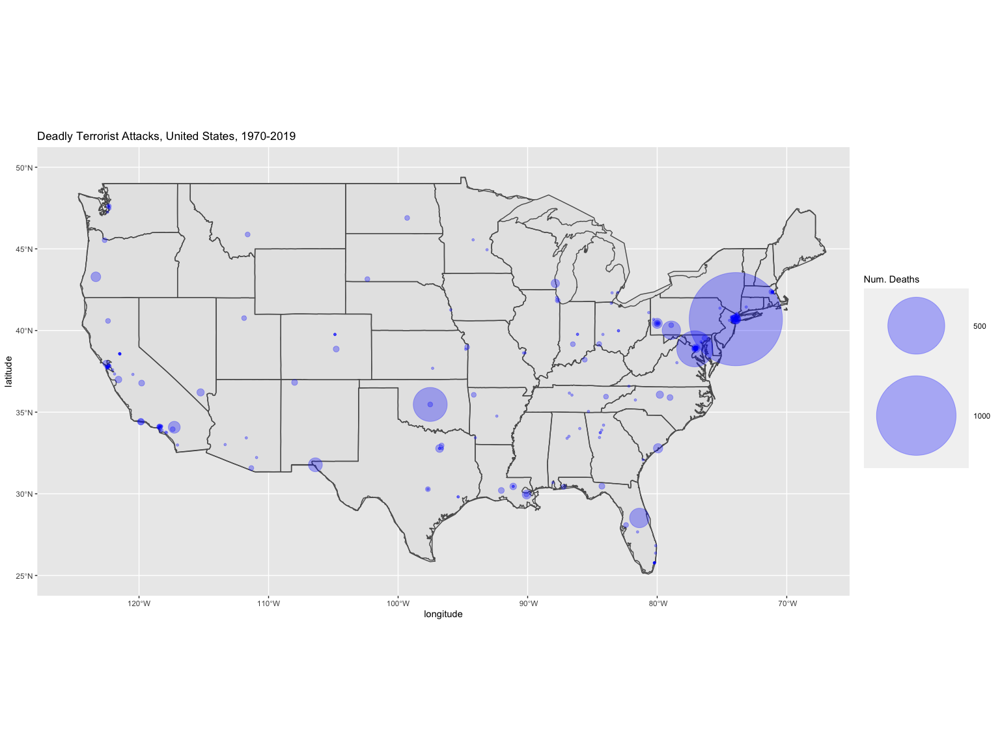
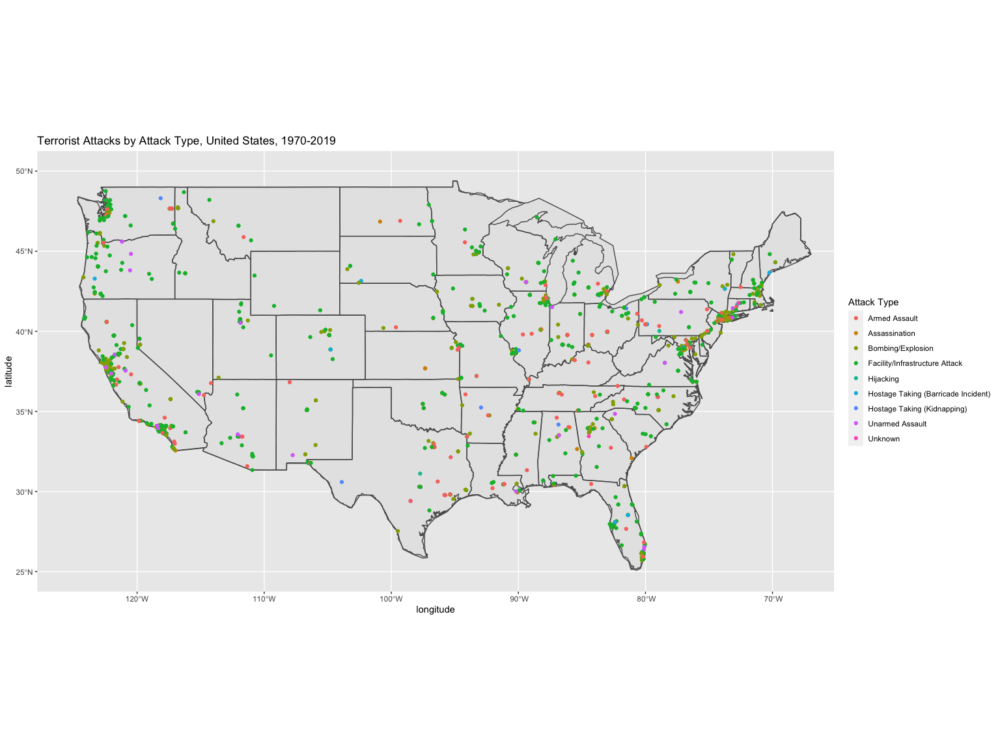
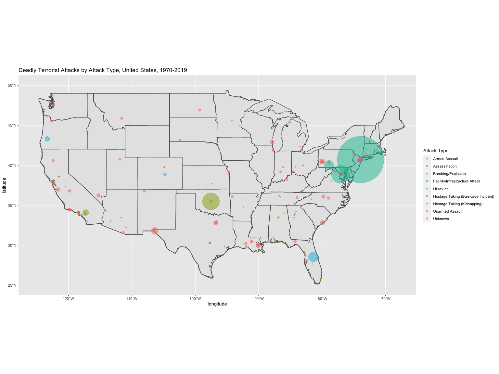
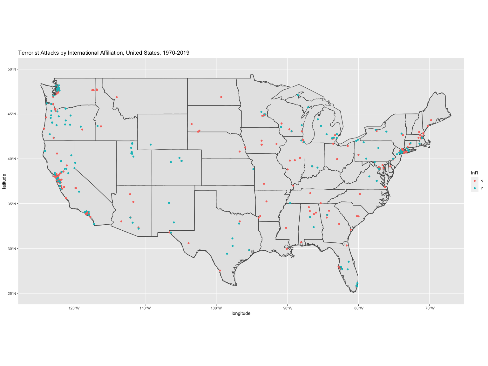
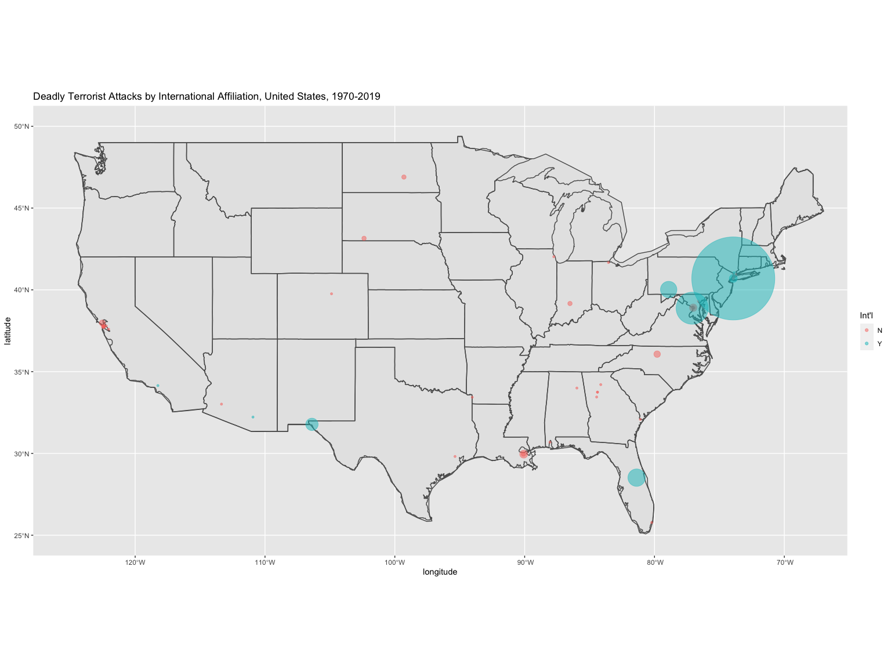
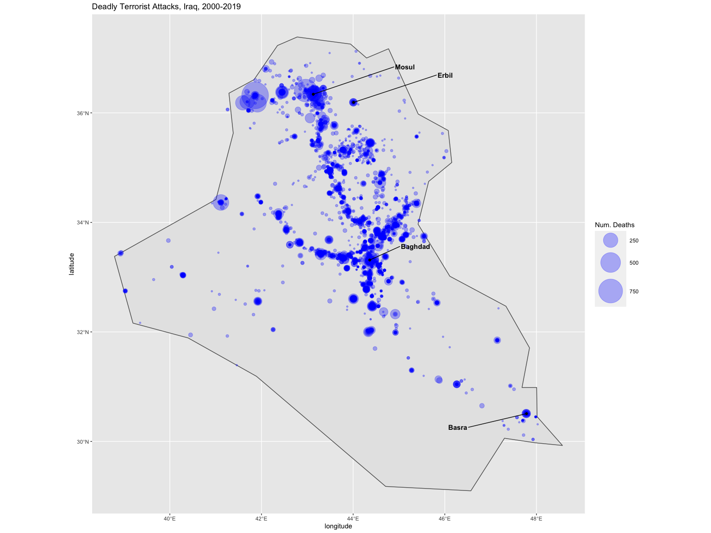

Global Terrorism Spatial Analysis
================
April 2021

*I performed this data exploration as my contribution to a group project
in one of my classes at Carnegie Mellon. Because the impact of terrorism
is so strongly related to the location of the attack and our dataset
included latitude/longitude coordinates of each attack, I thought that
maps would be an effective way to visually explore the data. I first
wanted to get an understanding of patterns of terrorism on a global
basis, then zoom in on the United States to visualize patterns of
terrorism in our home country.*

*The primary resource of our study is the [Global Terrorism
Database](https://www.start.umd.edu/gtd/), self described as “the most
comprehensive unclassified database on terrorist attacks in the world.”
The GTD includes data on over 200,000 attacks from 1970 to the present
(2019) with up to 135 different attributes for each attack. My group did
some preprocessing of the data using tidyverse. It’s this processed data
that I use for this analysis.*

*In order to generate the maps, I utilize the `rnaturalearth` package.
This was a very convenient package to use, as it provided access to
Natural Earth vector data and easily allowed me to subset countries and
regions. Furthermore, this package returned the data in `sf` format,
which made it very easy to plot using `ggplot2`. The source data in
`rnaturalearth` is the Natural Earth public domain dataset, which is
supported by the North American Cartographic Information Society. For
more information, visit the Natural Earth site
[here](https://www.naturalearthdata.com/). Conveniently, this data also
includes some basic demographic information, such as country population
estimates, which I also relied on in the analyses.*

### Data Transformation for Spatial Analysis

I first load the spatial data from the `rnaturalearth` package. In order
to merge that with the terror data, I recode some of the country names.
Some countries included in the terrorism data no longer exist (e.g.,
Yugoslavia). In these cases, I tried to recode them to their present day
equivalent countries, although in some instances this was not a perfect
one-to-one recode. (Today, Yugoslavia is part of seven different
countries.)

``` r
terror <- read.csv("data/tidy/tidy_terror.csv")

# Load map base layers
world <- ne_countries(scale = "small", returnclass = "sf")
world_points <- st_centroid(world)
world_points <- cbind(world, st_coordinates(st_centroid(world$geometry)))
usa <- ne_countries(scale = "small", returnclass = "sf", country = "united states of america")
states <- st_as_sf(map("state", plot = FALSE, fill = TRUE))
iraq <- ne_countries(scale = "small", returnclass = "sf", country = "iraq")

# Manually update some country names so that terror data merges cleanly with map data
# Note some assumptions made (e.g., Yugoslavia = Serbia)
terror$country <- recode(terror$country, 
                         "Bosnia-Herzegovina" = "Bosnia and Herzegovina", 
                         "Czechoslovakia" = "Czech Republic", 
                         "East Germany (GDR)" = "Germany",
                         "Guinea-Bissau" = "Guinea Bissau",
                         "Hong Kong" = "Hong Kong S.A.R.",
                         "North Yemen" = "Yemen",
                         "People's Republic of the Congo" = "Republic of Congo",
                         "Republic of the Congo" = "Republic of Congo",
                         "Serbia" = "Republic of Serbia",
                         "Serbia-Montenegro" = "Republic of Serbia",
                         "Slovak Republic" = "Slovakia",
                         "South Vietnam" = "Vietnam",
                         "South Yemen" = "Yemen",
                         "Soviet Union" = "Russia",
                         "United States" = "United States of America",
                         "Vatican City" = "Vatican",
                         "West Bank and Gaza Strip" = "Palestine",
                         "West Germany (FRG)" = "Germany",
                         "Yugoslavia" = "Serbia",
                         "Zaire" = "Democratic Republic of the Congo")

# Create dataframe with country level terrorist attacks, joined with map data
terror_country_sum <- terror %>%
  group_by(country) %>%
  summarize(attack_count = n(), killed_total=sum(killed_total, na.rm = TRUE))

world_terror_join <- merge(world, terror_country_sum, by.x = "admin", by.y = "country", all.x = TRUE, all.y = TRUE) %>%
  mutate(attacks_per_capita = attack_count/pop_est, killed_per_capita = killed_total/pop_est)
```

### Mapping Terrorist Attacks Across the Globe

I first take a look at global terrorism incidents across the globe from
1970 through 2019. I notice that there is widespread terrorism
throughout the globe. At a first glance, it looks like the highest
concentration of terrorist incidents are in Central and South America,
Europe, parts of Africa, the Middle East (particularly Iraq and Yemen),
South Asian countries (Afghanistan, Pakistan, India, Bangladesh, Nepal),
and the Philippines.

``` r
ggplot(data = world) +
  geom_sf() +
  geom_point(data = terror, aes(x=longitude, y=latitude), size = .01, color="red") +
  coord_sf(xlim = c(-165, 165), ylim = c(-50, 80)) +
  ggtitle("Global Terrorist Attacks, 1970-2019")
```

<!-- -->

Since September 11 was such a major terrorist attack, I wanted to see
if/how patterns of terrorism changed around the world since then. It
appears that there were fewer incidents in Europe, Central America and
Peru, but it looks like many of the terrorist incidents occurring in
Africa, the Middle East (particularly Iraq and Yemen), South Asian
countries (Afghanistan, Pakistan, India, Bangladesh, Nepal), and the
Philippines have occurred since September 11.

``` r
ggplot(data = world) +
    geom_sf() +
  geom_point(data = filter(terror, date >= as.Date("2001-09-12")), aes(x=longitude, y=latitude), size = .01, color="red") +
  coord_sf(xlim = c(-165, 165), ylim = c(-50, 80)) +
  ggtitle("Global Terrorist Attacks since 9/11")
```

<!-- -->

I thought it would be important to visualize the most catastrophic
terrorist incidents, specifically those with more than 100 deaths. I
view these for three time periods: the entire period, since 2000, and
since September 11. I observe that in the U.S., 9/11 was by far the most
deadly terrorist attack, but the highest concentration of attacks with
over 100 deaths appears to be centered in the Middle East. There are
very few of these extremely deadly attacks in Europe and South America,
especially since 2000.

``` r
ggplot(data = world) +
    geom_sf() +
  geom_point(data = filter(terror, killed_total>100, na.rm=TRUE), aes(x=longitude, y=latitude, size=killed_total), color = rgb(red=0, green=0, blue=1, alpha=0.3)) +
  scale_size(name="Num. Deaths", range=c(.1, 20)) +
  coord_sf(xlim = c(-165, 165), ylim = c(-50, 80)) +
  ggtitle("Global Terrorist Attacks with over 100 Deaths, 1970-2019")
```

<!-- -->

``` r
ggplot(data = world) +
    geom_sf() +
  geom_point(data = filter(terror, killed_total>100, date >= as.Date("2000-01-01"), na.rm=TRUE), aes(x=longitude, y=latitude, size=killed_total), color = rgb(red=0, green=0, blue=1, alpha=0.3)) +
  scale_size(name="Num. Deaths", range=c(.1, 20)) +
  coord_sf(xlim = c(-165, 165), ylim = c(-50, 80)) +
  ggtitle("Global Terrorist Attacks with over 100 Deaths, 2000-2019")
```

<!-- -->

``` r
ggplot(data = world) +
    geom_sf() +
  geom_point(data = filter(terror, killed_total>100, date >= as.Date("2001-09-12"), na.rm=TRUE), aes(x=longitude, y=latitude, size=killed_total), color = rgb(red=0, green=0, blue=1, alpha=0.3)) +
  scale_size(name="Num. Deaths", range=c(.1, 20)) +
  coord_sf(xlim = c(-165, 165), ylim = c(-50, 80)) +
  ggtitle("Global Terrorist Attacks with over 100 Deaths since 9/11")
```

<!-- -->

In this next series of maps, the countries are color coded based on
number of attacks and number of deaths from attacks. I look at this both
at a raw count and per capita basis. What stands out across each map is
that Iraq and Afghanistan have the highest number of attacks and deaths,
on a raw and per capita basis.

``` r
ggplot(data = world_terror_join) +
    geom_sf(aes(fill = attack_count)) +
  coord_sf(xlim = c(-165, 165), ylim = c(-50, 80)) +
  scale_fill_viridis_c(option = "plasma", trans = "sqrt") +
  labs(fill = "Num. Attacks") +
  ggtitle("Number of Terrorist Attacks by Country, 1970-2019")
```

<!-- -->

``` r
ggplot(data = world_terror_join) +
    geom_sf(aes(fill = attacks_per_capita)) +
  coord_sf(xlim = c(-165, 165), ylim = c(-50, 80)) +
  scale_fill_viridis_c(option = "plasma") +
  labs(fill = "Num. Attacks per Capita") +
  ggtitle("Number of Terrorist Attacks by Country, per Capita, 1970-2019")
```

<!-- -->

``` r
ggplot(data = world_terror_join) +
    geom_sf(aes(fill = killed_total)) +
  coord_sf(xlim = c(-165, 165), ylim = c(-50, 80)) +
  scale_fill_viridis_c(option = "plasma", trans = "sqrt") +
  labs(fill = "Num. Deaths") +
  ggtitle("Number of Deaths from Terrorist Attacks by Country, 1970-2019")
```

<!-- -->

``` r
ggplot(data = world_terror_join) +
    geom_sf(aes(fill = killed_per_capita)) +
  coord_sf(xlim = c(-165, 165), ylim = c(-50, 80)) +
  scale_fill_viridis_c(option = "plasma") +
  labs(fill = "Num. Deaths per Capita") +
  ggtitle("Number of Deaths from Terrorist Attacks by Country, per Capita, 1970-2019")
```

<!-- -->

### Terrorism in the United States

Next, I take a closer look at terrorism activity in the mainland U.S.

``` r
ggplot(data = usa) +
  geom_sf() +
  geom_sf(data = states, fill = NA) +
  geom_point(data = filter(terror, country == "United States of America"), aes(x=longitude, y=latitude), color = "red") +
  coord_sf(xlim = c(-125, -68), ylim = c(25, 50)) +
  ggtitle("Terrorist Attacks, United States, 1970-2019")
```

<!-- -->

Filtering to look at only deadly attacks, I observe which attacks in the
United States were most deadly. The attacks on 9/11 stand out as being
extremely deadly compared to all other attacks. Besides 9/11, the 1995
Oklahoma City bombing also stands out.

``` r
ggplot(data = usa) +
  geom_sf() +
  geom_sf(data = states, fill = NA) +
  geom_point(data = filter(terror, country == "United States of America", killed_total > 0, na.rm=TRUE), aes(x=longitude, y=latitude, size=killed_total), color = rgb(red=0, green=0, blue=1, alpha=0.3)) +
  coord_sf(xlim = c(-125, -68), ylim = c(25, 50)) +
  scale_size(name="Num. Deaths", range=c(1, 50)) +
  ggtitle("Deadly Terrorist Attacks, United States, 1970-2019")
```

<!-- -->

I also wanted to visualize the incidents in the United States by attack
type. At a high level, the most common attack types appear to be
Bombing/Explosion and Facility/Infrastructure Attack. The second map is
filtered only for deadly attacks, with the points scaled by number of
total deaths.

``` r
ggplot(data = usa) +
  geom_sf() +
  geom_sf(data = states, fill = NA) +
  geom_point(data = filter(terror, country == "United States of America"), aes(x=longitude, y=latitude, color=attack_type)) +
  coord_sf(xlim = c(-125, -68), ylim = c(25, 50)) +
  labs(color = "Attack Type") +
  ggtitle("Terrorist Attacks by Attack Type, United States, 1970-2019")
```

<!-- -->

``` r
ggplot(data = usa) +
  geom_sf() +
  geom_sf(data = states, fill = NA) +
  geom_point(data = filter(terror, country == "United States of America", killed_total > 0, na.rm=TRUE), aes(x=longitude, y=latitude, color=attack_type, size=killed_total), alpha=.5) +
  coord_sf(xlim = c(-125, -68), ylim = c(25, 50)) +
  labs(color = "Attack Type") +
  scale_size(guide = "none", range=c(1, 50)) +
  ggtitle("Deadly Terrorist Attacks by Attack Type, United States, 1970-2019")
```

<!-- -->

I thought it would be interesting to attempt to differentiate between
international and domestic terrorism in the United States. The
`group_int` variable allows me to do that. This is a categorical
variable, where `Y` means the attack was defined as international
terrorism, while `N` indicates the attack was domestic. For most
attacks, this information is not available. Those have been filtered
out.  
Where I do have this information, I observe that both international and
domestic terrorism is widespread. It appears that the most deadly
attacks have been international, driven by 9/11.

``` r
ggplot(data = usa) +
  geom_sf() +
  geom_sf(data = states, fill = NA) +
  geom_point(data = filter(terror, country == "United States of America", !is.na(group_int)), aes(x=longitude, y=latitude, color=group_int)) +
  coord_sf(xlim = c(-125, -68), ylim = c(25, 50)) +
  labs(color = "Int'l") +
  ggtitle("Terrorist Attacks by International Affiliation, United States, 1970-2019")
```

<!-- -->

``` r
ggplot(data = usa) +
  geom_sf() +
  geom_sf(data = states, fill = NA) +
  geom_point(data = filter(terror, country == "United States of America", !is.na(group_int), killed_usa > 0, na.rm=TRUE), aes(x=longitude, y=latitude, size=killed_total, color=group_int), alpha = 0.5) +
  coord_sf(xlim = c(-125, -68), ylim = c(25, 50)) +
  scale_size(guide = "none", range=c(1, 50)) +
  labs(color = "Int'l") +
  ggtitle("Deadly Terrorist Attacks by International Affiliation, United States, 1970-2019")
```

<!-- -->

### Terrorism in the Middle East & South Asia

Because of the high concentration of attacks in the Middle East and
South Asia, I wanted to take a closer look at attacks in those
countries. Looking at this region, certain areas stand out as having an
incredibly high concentration of terror attacks, including Yemen, Sri
Lanka, India, Bangladesh, Bhutan, Pakistan, Afghanistan, Iraq, and the
region consisting of Syria, Lebanon, Israel, and Palestine.

``` r
ggplot(data = world) +
    geom_sf() +
  geom_point(data = filter(terror), aes(x=longitude, y=latitude), size = .01, color="red") +
  coord_sf(xlim = c(20, 100), ylim = c(5, 45)) +
  ggtitle("Terrorist Attacks, Middle East and South Asia, 1970-2019") +
  theme(panel.grid.major = element_line(color = "gray60", linetype = "dashed", size = 0.25), 
         panel.background = element_rect(fill = "aliceblue")) +
  geom_text(data= world_points,aes(x=X, y=Y, label=name),
            color = "gray20", fontface = "italic", check_overlap = T, size = 5)
```

<!-- -->

``` r
ggplot(data = world) +
    geom_sf() +
  geom_point(data = filter(terror, killed_total > 50, !is.na(killed_total)), aes(x=longitude, y=latitude, color=killed_total), size = 2) +
  scale_color_viridis_c(option = "plasma") +
  coord_sf(xlim = c(20, 100), ylim = c(5, 45)) +
  ggtitle("Terrorist Attacks with over 50 Deaths, Middle East and South Asia, 1970-2019") +
  labs(fill = "Num. Deaths") +
  theme(panel.grid.major = element_line(color = "gray60", linetype = "dashed", size = 0.25), 
         panel.background = element_rect(fill = "aliceblue")) +
  geom_text(data= world_points,aes(x=X, y=Y, label=name),
            color = "gray20", fontface = "italic", check_overlap = T, size = 5)
```

<!-- -->

Since Iraq had the most number of attacks and deaths from terrorism, on
a raw and per capita basis, I decided to look at deadly attacks just in
that country. I limited the time period to the most recent decades, from
2000-2019. I see an incredibly high concentration of deadly terror
attacks, and that they are predominately clustered throughout the major
population centers.

``` r
iraq_cities <- data.frame(city = c("Baghdad",  "Basra", "Mosul", "Erbil"), 
                          lat = c(33.312805, 30.508102, 36.340000, 36.191113), 
                          lng = c(44.361488, 47.783489,     43.130001, 44.009167))
iraq_cities <- st_as_sf(iraq_cities, coords = c("lng", "lat"), remove = FALSE, crs = 4326, agr = "constant")

ggplot(data = iraq) +
  geom_sf() +
  geom_point(data = filter(terror, country == "Iraq", killed_total > 0, date >= as.Date("2000-01-01"), na.rm=TRUE), 
             aes(x=longitude, y=latitude, size=killed_total), color = rgb(red=0, green=0, blue=1, alpha=0.3)) +
  scale_size(name="Num. Deaths", range=c(1, 20)) +
  geom_sf(data = iraq_cities) +
  geom_text_repel(data = iraq_cities, aes(x = lng, y = lat, label = city), 
        size = 3.9, col = "black", fontface = "bold", nudge_x = c(1, -1.5, 2, 2), nudge_y = c(0.25, 
            -0.25, 0.5, 0.5)) +
  ggtitle("Deadly Terrorist Attacks, Iraq, 2000-2019")
```

<!-- -->
